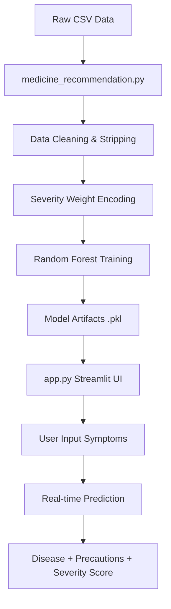

# 🏥 Medicine Recommendation System

A state-of-the-art AI/ML-powered healthcare informatics tool that predicts diseases based on patient symptoms. The system utilizes a severity-weighted Random Forest classifier to provide highly accurate diagnoses, educational descriptions, and actionable medical precautions.

---

## 🌟 Key Features

- **AI-Driven Diagnostics**: Predicts 41 different diseases using a Random Forest model with ~100% test accuracy.
- **Clinical Severity Weighting**: Unlike binary (0/1) models, this system weights symptoms (1–7) based on clinical seriousness (e.g., chest pain vs. itching).
- **Interactive UI**: A minimal, dark-themed Streamlit application for seamless user interaction.
- **Comprehensive Output**: Returns disease description, 4-step precautions, and severity analysis.
- **Automated Validation**: Includes a 25-case test suite for verifying model reliability across various medical conditions.

---

## 🧠 Model & Logic

### 1. The Algorithm
The system uses a **Random Forest Classifier** as its primary engine. It was chosen for its:
- High accuracy on categorical medical data.
- Ability to handle the high dimensionality of 131 unique symptoms.
- Robustness against overfitting, especially with balanced datasets.

### 2. Severity-Weighted Preprocessing
Standard models often treat all symptoms as equal. This system replaces the binary presence of a symptom with its **clinical weight**:
- **X-Matrix**: Each row is a vector of 131 symptoms.
- **Values**: If a symptom is present, its value is its weight (1–7) from `Symptom-severity.csv`. If absent, the value is 0.
- **Benefit**: The model learns that high-severity symptoms (like `breathlessness`) are stronger indicators of serious conditions than low-severity ones.

---

## 📊 Data Flow



---

## 📂 Project Structure

```text
medicine_recommendation_system/
├── data/
│   ├── dataset.csv                 # 4920 patient cases (Balanced: 120 per disease)
│   ├── Symptom-severity.csv        # Clinical weights (1–7) for 131 symptoms
│   ├── symptom_Description.csv     # Educational paragraphs for 41 diseases
│   └── symptom_precaution.csv      # 4 actionable precautions per disease
├── models/
│   ├── model.pkl                   # Persisted Random Forest model
│   ├── label_encoder.pkl           # Disease label decoder
│   ├── symptoms_list.pkl           # Global symptom feature index
│   └── severity_dict.pkl           # Symptom-to-weight lookup
├── .streamlit/
│   └── config.toml                 # Dark theme and UI branding
├── medicine_recommendation.py      # Core ML Pipeline (Loading -> Training -> Saving)
├── app.py                          # Minimalistic Web Application
├── test_cases.py                   # 25-Case Validation Suite
├── requirements.txt                # Dependency manifest
└── README.md                       # Comprehensive documentation
```

---

## 🚀 Setup & Usage

### 1. Installation
Ensure you have Python 3.8+ installed.
```bash
pip install -r requirements.txt
```

### 2. Train and Build (Backend)
This script processes the data, trains the model, and generates the `models/` artifacts.
```bash
python medicine_recommendation.py
```

### 3. Run Validation Tests
Verify the model's accuracy against 25 diverse medical scenarios.
```bash
python test_cases.py
```

### 4. Launch the Web App
Start the interactive dashboard.
```bash
streamlit run app.py
```

---

## 🎨 UI & User Experience
The application features a **monochrome diagnostic interface** (Pure Black & White):
- **Monochrome Theme**: High-contrast, brutalist aesthetics using only Black and White.
- **Sharp Typography**: Uses the 'Inter' typeface with uppercase labeling for a clinical feel.
- **Symptom Tags**: High-contrast tags for clear visibility of inputs.
- **System Stats**: A technical footer showing dataset scale and model performance.
- **Protocol Cards**: Precautions are presented as numbered clinical protocols.

---

## 🧪 Example Test Case
**Symptoms**: `continuous_sneezing`, `shivering`, `chills`, `watering_from_eyes`
- **Predicted Disease**: Allergy
- **Severity Score**: 16 / 70
- **Precautions**: 
  1. Apply calamine
  2. Cover area with bandage
  3. Use ice to compress itching
  4. Avoid allergens

---

## ⚖️ Disclaimer
*This system is intended for educational and informational purposes only. It is not a substitute for professional medical advice, diagnosis, or treatment. Always seek the advice of your physician or other qualified health provider with any questions you may have regarding a medical condition.*
